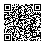

Words from [Paul Halmos](https://en.wikipedia.org/wiki/Paul_Halmos):

> The beginner ... should not be discouraged if ... he finds that he does not have
> the prerequisites for reading the prerequisites.

## Languages Used

* [Bash](https://en.wikipedia.org/wiki/Bash_(Unix_shell))
* [C](https://en.wikipedia.org/wiki/C_(programming_language))
* [HTML](https://en.wikipedia.org/wiki/HTML) and [CSS](https://en.wikipedia.org/wiki/CSS)
* [LaTeX](https://en.wikipedia.org/wiki/LaTeX)
* [Lua](https://en.wikipedia.org/wiki/Lua_(programming_language))
* [MATLAB](https://en.wikipedia.org/wiki/MATLAB)
* [Markdown](https://en.wikipedia.org/wiki/Markdown)
* [Python](https://en.wikipedia.org/wiki/Python_(programming_language))
    * [SageMath](https://en.wikipedia.org/wiki/SageMath)
* [XML](https://en.wikipedia.org/wiki/XML)

## Academic Interests

* Quantum computers and quantum cryptography

## Other Interests

* Privacy, security, and anonymity on the Internet
* Infosec and physical security
* Mass surveillance deterrence
* Linux
* Free and open-source software + hardware
* Dark UI themes
* Sociology of the internet

## Monero (XMR) Address

```
86SCYAZ2D4x5zpQ1qfZ4yEZ9FxkPwCNNx56q4eGwsRMsRXZsH9vmJPFfBxG7mC5GPQgcQa7woKhzmer1pyNoEemKMtu5zp4
```



## Avatar credit
Sketch by JG

